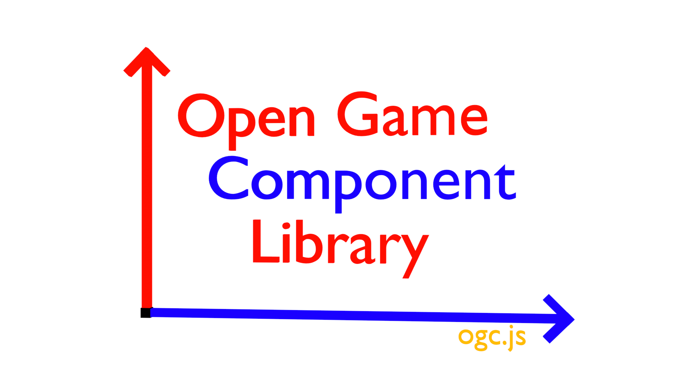

# Open Game Component Library

The Open Game Component Library is a simple, easy-to-learn library for 2D-Game-Programming using JavaScript. It contains different components which makes it easy to code a simple 2D-Game in just a few lines.

## Get Started

### 1. Import

#### Import by downloading the file

  * download the file 'ogc.js' from https://github.com/mattes2008/OpenGameComponentLibrary/blob/master/src/ogc.js
  * include it as a script-tag

  **For Example:**

  Directory-Structure:
    
```
  Project 
  |index.html
  |_js
  | |ogc.js
  | |scripts.js
  | |___________
  |_css
  | |style.css
  | |___________
  |_____________
```

  index.html:

```html
<!DOCTYPE html>
<html>
<head>
    <title>Project</title>
    <link rel="stylesheet" href="css/style.css">
    <script src="js/ogc.js"
</head>
<body>
<script src="js/scripts.js"></script>
</body>
</html>
```

### 2. Initialization

To initialize the library call the 'init'-function with the stage's parent object:

  ```js
    ogc.init(destination);
  ```

  After initialization, select the components you want to use in your program. For example:

  ```js
    const {figure, stage} = ogc;
  ```

By running this line, you are abled to call the components by their name instead of ogc.name:

```componentName```
 instead of 
```ogc.componentName```

## Components

The components are the central elements of ogc. These components make it easy for you to code your game and make it alive.

### ogc.stage

Stage is a component of ogc. It is the area in which the game take place. The stage is created by calling the 'init'-method. After creating, you can call the stage's properties by accessing the stage and the property.

```js

  ogc.init(destination); //initialize ogc
  ogc.stage.property //access property

```

#### Properties

  * `size`
    -`width` width of the stage
    -`height` height of the stage
  * `resize(width, height)` resize the stage
  * `gravity` gravity of stage
  * `background`
    - `list` list of backgrounds
    - `actual` number of actual background
    - `add(type, value, title)` add a background
    - `remove(index)` remove a background
    - `to(index)` chance to specific background
    - `next()` next background
    - `last()` last background
  * `event`
    - `list` list of event listeners
    - `add(event, method, title)` add an event listener
    - `remove(title)` remove an event listener
  * `toPixel(x, y)` convert coordinate to pixel
  * `toCoordinate(x, y)` convert pixel to coordinate
  * `element` stage element
  * `update()` update stage

### ogc.figure

  * `create(name, costumes)`
  * `all`

Figure is a component of ogc. Figures are elements on the stage which can be used as players, enemies, displays and many more.
To create a figure you have to call the 'create'-function of figure with the name and an array of different costumes. After creating, you can call the figure by the 'all' property and the figure's name.

```js

  ogc.figure.create(name, costumes); //create figure
  ogc.figure.all.name //access the figure

```

Every figure has different properties which help you to interact with them. Your calling them by access the figure and the property name.

```js

  ogc.figure.create(name, costumes); //create figure
  ogc.figure.all.name.property //access the property

```

#### Properties

  * `position`
    - `x` position on the x-axis
    - `y` position on the y-axis
  * `move(direction, length)` move the figure about a length into a direction
  * `moveTo(x, y)` move the figure to an x and y coordinate
  * `moveToObject(object)` move the figure to another object
  * `gravity`
    - `weight` figure specific weight
    - `enable(weight)` enable gravity with a figure specific weight
    - `disable()` disable gravity for the figure
  * `rotation` rotation of figure
  * `rotate(value, type)` chance the figures rotation to or about a specific value
  * `distance(object)` calculate the distance to an object
  * `collision`
    - `collider` figure specific collision radius
    - `withObject(object, radius, objectRadius)` check for a collision with a specific object
    - `add(title, object, method, radius, objectRadius)` add a collision listener
    - `remove(title)` remove a collision listener
    - `list` list of collision listeners
  * `size`
    - `width` width of the figure
    - `height` height of the figure
  * `resize(width, height)` resize the figure
  * `visibility`
    - `state` state of visibility
    - `show()` change visibility to true
    - `hide()` change visibility to false
    - `toggle()` toggle visibility
  * `costumes`
    - `list` list of costumes
    - `actual` number of actual costume
    - `add(src)` add a costume
    - `remove(index)` remove a costume
    - `next()` next costume
    - `last()` last costume
    - `to(index)` chance to specific costume
  * `event`
    - `list` list of event listeners
    - `add(event, method, title)` add an event listener
    - `remove(title)` remove an event listener
  * `element` figure element
  * `update` update figure
  * `remove` remove figure

#### Templates

  * `player(name, costume)` 2d player figure
  * `jumpNRunPlayer(name, costume)` 2d jump-n-run figure
  * `variableDisplay(name, referenceVariable)` variable-display figure

### ogc.audio

Audio is a component of ogc. Audio allows you to play audio in your game. You can access audio after calling init. You can access the properties of audio by accessing audio and the property.

```js

  ogc.init(destination); //initialize ogc
  ogc.audio.property //access property

```

#### Properties

  * `list` list of audio titles
  * `add(title, src)` add an audio title
  * `remove(title)` remove an audio title
  * `play(title)` play an audio title
  * `pause(title)` pause an audio title
  * `setAttribute(title, attribute, value)` change settings of an audio title
  * `quick`
    - `volume` quick-audio volume
    - `play(src)` play audio quickly

### ogc.storage

Storage is a component of ogc. Storage can be sed to store data during short and long times. You can access storage after calling init. You can access the properties of storage by accessing storage and the property.

```js

  ogc.init(destination); //initialize ogc
  ogc.storage.property //access property

```

#### Properties

  * `sessionStorage`
    - `add(key, value, override)` create a key in 'sessionStorage'
    - `read(key)` get a key in 'sessionStorage'
    - `remove(key)` remove a key in 'sessionStorage'
    - `list()` list 'sessionStorage'
    - `clear()` clear 'sessionStorage'
  * `localStorage`
    - `add(key, value, override)` create a key in 'localStorage'
    - `read(key)` get a key in 'localStorage'
    - `remove(key)` remove a key in 'localStorage'
    - `list()` list 'localStorage'
    - `clear()` clear 'localStorage'

### ogc.variables

Variables is a component of ogc. It is used to store data until a reload. It can be accessed by accessing variables and the property after calling init.

```js

  ogc.init(destination); //initialize ogc
  ogc.variables.property //access property

```

#### Properties

  * `storage` collection of variables, stored in variables component
  * `set(key, value, override)` change or create a variable, stored in variables component
  * `get(key)` read a variable, stored in variables component
  * `remove(key)` delete a variable, stored in variables component
  * `clear()` delete all variables, stored in variables component
